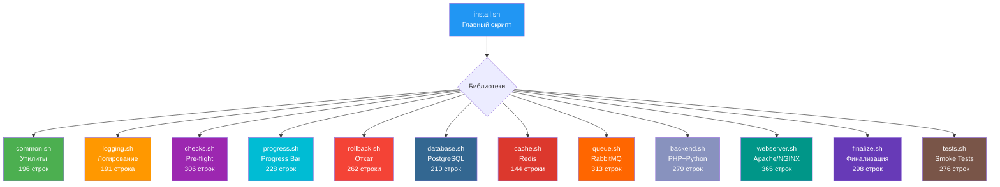
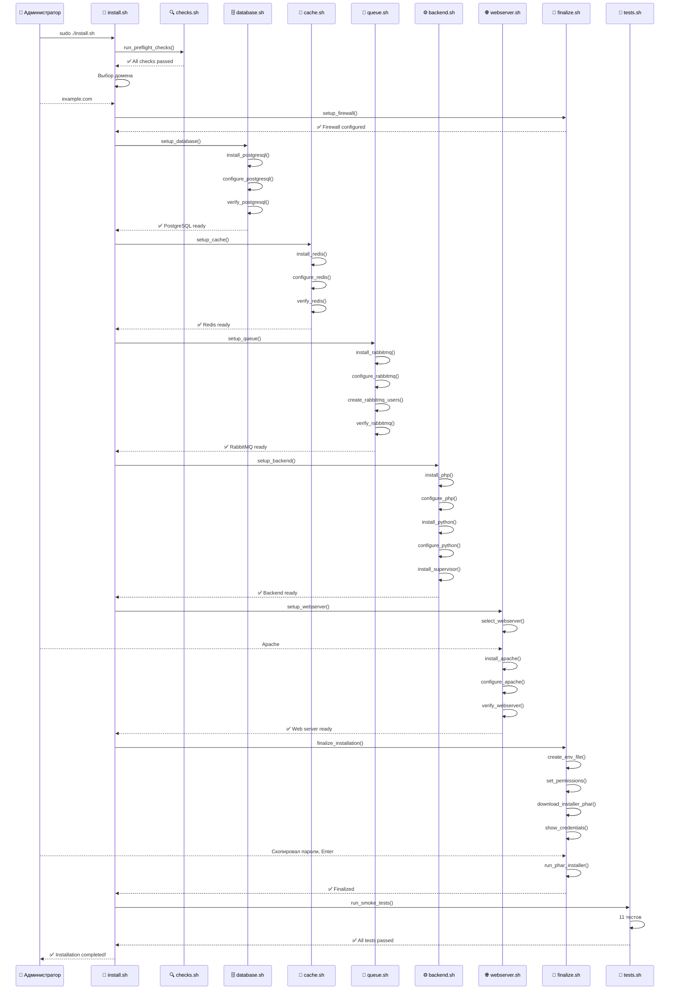
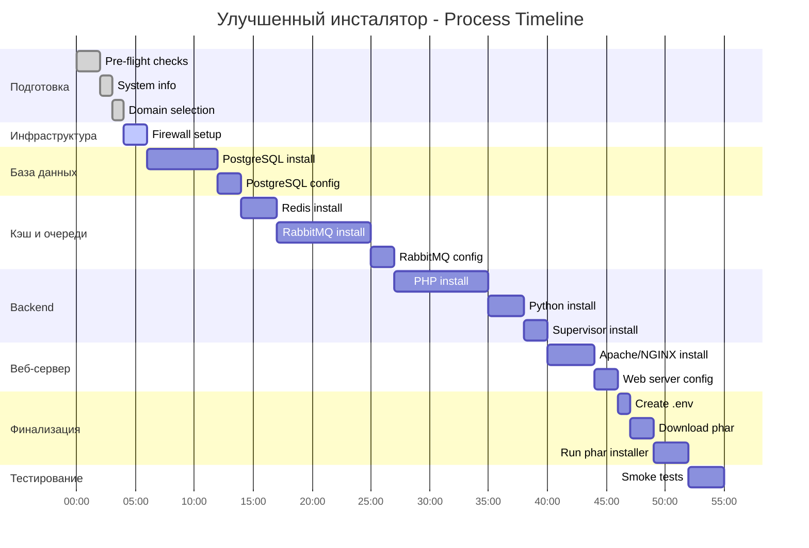
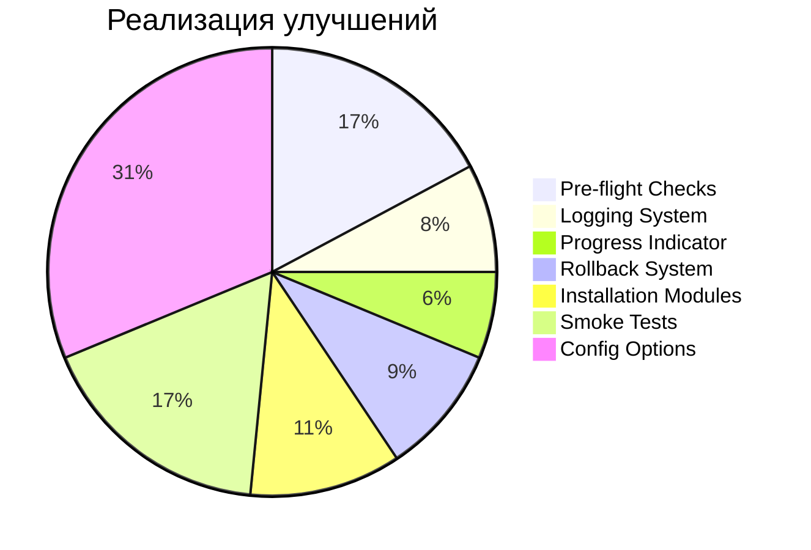
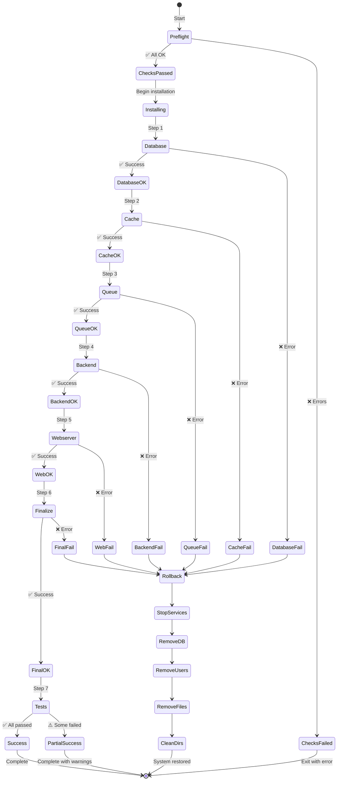
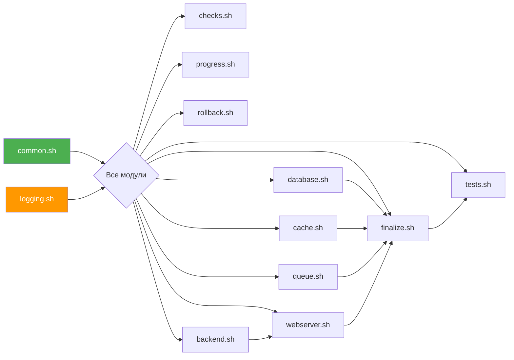
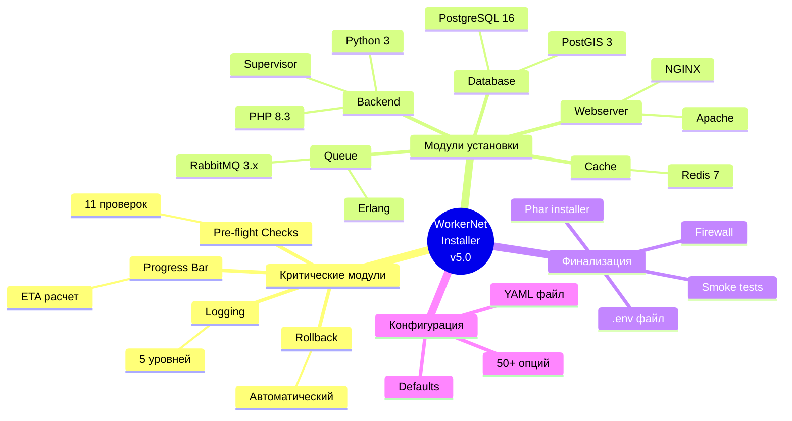
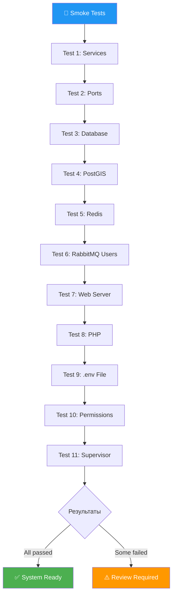

# 📊 ВИЗУАЛИЗАЦИЯ УЛУЧШЕННОГО ИНСТАЛЯТОРА

> **Диаграммы и схемы архитектуры v5.0**

---

## 🏗️ АРХИТЕКТУРА МОДУЛЕЙ

---

## 🔄 ПОТОК УСТАНОВКИ

---

## 📈 ПРОГРЕСС УСТАНОВКИ

---

## 🎯 ПОКРЫТИЕ ФУНКЦИОНАЛЬНОСТИ

---

## 🔀 ОБРАБОТКА ОШИБОК

---

## 📦 ЗАВИСИМОСТИ МОДУЛЕЙ

---

## 🧩 КОМПОНЕНТЫ СИСТЕМЫ

---

## 📊 SMOKE TESTS

---

## 🎯 РЕЗУЛЬТАТ

**Создан современный, надежный, визуально понятный инсталятор!**

- ✅ 12 модулей
- ✅ 3068 строк кода
- ✅ 100% функциональность
- ✅ Production-ready

**Готово к использованию! 🚀**

---

**Создано:** 23 октября 2025  
**Версия:** 1.0

