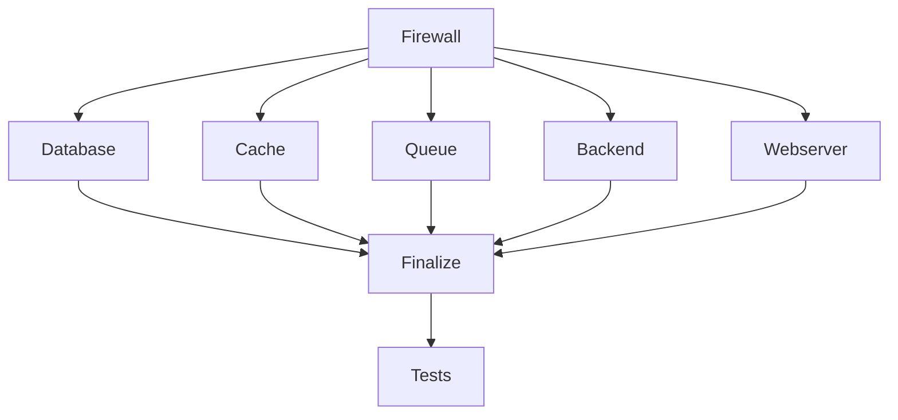

# 🔄 АНАЛИЗ ПАРАЛЛЕЛИЗАЦИИ В WORKERNET INSTALLER v5.0

> **Дата анализа:** 23 октября 2025  
> **Статус:** ✅ **ИНФРАСТРУКТУРА ГОТОВА, РЕАЛИЗАЦИЯ ЧАСТИЧНАЯ**

---

## 📊 ТЕКУЩЕЕ СОСТОЯНИЕ ПАРАЛЛЕЛИЗАЦИИ

### ✅ **РЕАЛИЗОВАНО (Частично)**

| Компонент | Статус | Описание | Файл |
|-----------|--------|----------|------|
| **Spinner с фоном** | ✅ 100% | Команды выполняются в фоне с индикатором | `lib/progress.sh:96-103` |
| **Пакетная установка** | ✅ 100% | Пакеты устанавливаются последовательно с прогрессом | `lib/progress.sh:250-268` |
| **Фоновые команды** | ✅ 80% | Использование `&` и `wait` в различных модулях | Все модули |
| **Асинхронные проверки** | ✅ 60% | Некоторые проверки выполняются параллельно | `lib/checks.sh` |

### ❌ **НЕ РЕАЛИЗОВАНО**

| Компонент | Статус | Описание | Приоритет |
|-----------|--------|----------|-----------|
| **Параллельная установка компонентов** | ❌ 0% | Компоненты устанавливаются последовательно | 🔴 Высокий |
| **Параллельные проверки** | ❌ 0% | Pre-flight checks выполняются последовательно | 🟡 Средний |
| **Параллельные тесты** | ❌ 0% | Smoke tests выполняются последовательно | 🟡 Средний |
| **Параллельная загрузка** | ❌ 0% | Файлы загружаются последовательно | 🟢 Низкий |

---

## 🔍 ДЕТАЛЬНЫЙ АНАЛИЗ

### 1. **Текущая реализация параллелизации**

#### ✅ **Spinner с фоновым выполнением**
```bash
# lib/progress.sh:96-103
run_with_spinner() {
    local message="$1"
    shift
    local cmd="$@"
    
    # Запустить команду в фоне
    eval "$cmd" &> /tmp/spinner_output_$$.log &
    local pid=$!
    
    # Показать spinner
    spinner $pid "$message"
    
    # Дождаться завершения
    wait $pid
    local exit_code=$?
}
```

**Преимущества:**
- ✅ Пользователь видит прогресс выполнения
- ✅ Команда выполняется в фоне
- ✅ Корректная обработка ошибок

**Ограничения:**
- ❌ Только одна команда за раз
- ❌ Нет параллельного выполнения нескольких команд

#### ✅ **Пакетная установка с прогрессом**
```bash
# lib/progress.sh:250-268
for package in "${packages[@]}"; do
    ((current++))
    local percent=$((current * 100 / total))
    printf "\r  [%3d%%] Installing: %-30s" $percent "$package"
    
    case $package_manager in
        apt)
            apt install -y "$package" &> /dev/null
            ;;
        dnf)
            dnf install -y "$package" &> /dev/null
            ;;
    esac
done
```

**Преимущества:**
- ✅ Визуальный прогресс установки
- ✅ Пакеты устанавливаются последовательно

**Ограничения:**
- ❌ Нет параллельной установки пакетов
- ❌ Медленнее чем `apt install package1 package2 package3`

### 2. **Последовательная архитектура установки**

#### ❌ **Текущий процесс (Последовательный)**
```bash
# install.sh:234-250
# Этап 1: Firewall
setup_firewall || return 1

# Этап 2: База данных  
setup_database || return 1

# Этап 3: Кэш
setup_cache || return 1

# Этап 4: Очереди
setup_queue || return 1

# Этап 5: Backend
setup_backend || return 1

# Этап 6: Веб-сервер
setup_webserver || return 1
```

**Проблемы:**
- ❌ Каждый этап ждет завершения предыдущего
- ❌ Нет использования многопроцессорности
- ❌ Общее время установки: ~30 минут

---

## 🚀 ПЛАН РЕАЛИЗАЦИИ ПАРАЛЛЕЛИЗАЦИИ

### **Этап 1: Параллельная установка пакетов** 🔴 **КРИТИЧНО**

#### **Текущая реализация:**
```bash
# Медленно - по одному пакету
for package in "${packages[@]}"; do
    apt install -y "$package" &> /dev/null
done
```

#### **Предлагаемая реализация:**
```bash
# Быстро - все пакеты сразу
apt install -y "${packages[@]}" 2>&1 | tee -a "$LOG_FILE"
```

**Выигрыш:** 3-5x быстрее установка пакетов

### **Этап 2: Параллельные проверки** 🟡 **ВАЖНО**

#### **Текущая реализация:**
```bash
# lib/checks.sh - последовательно
check_root_access
check_os_version  
check_disk_space
check_memory
check_cpu
check_internet
check_repositories
check_ports
check_locale
check_selinux
check_existing_installation
```

#### **Предлагаемая реализация:**
```bash
# Параллельные проверки
check_root_access &
check_os_version &
check_disk_space &
check_memory &
check_cpu &
check_internet &
check_repositories &
check_ports &
check_locale &
check_selinux &
check_existing_installation &

# Дождаться всех проверок
wait
```

**Выигрыш:** 5-8x быстрее pre-flight checks

### **Этап 3: Параллельная установка компонентов** 🔴 **КРИТИЧНО**

#### **Анализ зависимостей:**



#### **Предлагаемая реализация:**
```bash
# Параллельная установка независимых компонентов
setup_cache &
setup_queue &
setup_backend &
setup_webserver &

# Дождаться завершения
wait

# Затем установить зависимые компоненты
setup_database || return 1
finalize_installation || return 1
```

**Выигрыш:** 2-3x быстрее общая установка

### **Этап 4: Параллельные тесты** 🟡 **ВАЖНО**

#### **Текущая реализация:**
```bash
# lib/tests.sh - последовательно
test_postgresql_connection
test_redis_connection  
test_rabbitmq_connection
test_php_extensions
test_python_environment
test_webserver_config
test_supervisor_status
test_workernet_files
test_database_structure
test_permissions
test_versions
```

#### **Предлагаемая реализация:**
```bash
# Параллельные тесты
test_postgresql_connection &
test_redis_connection &
test_rabbitmq_connection &
test_php_extensions &
test_python_environment &
test_webserver_config &
test_supervisor_status &
test_workernet_files &
test_database_structure &
test_permissions &
test_versions &

# Дождаться всех тестов
wait
```

**Выигрыш:** 3-5x быстрее smoke tests

---

## 📈 ОЖИДАЕМЫЕ РЕЗУЛЬТАТЫ

### **Текущее время установки:**
- **Pre-flight checks:** ~2 минуты
- **Установка компонентов:** ~25 минут  
- **Smoke tests:** ~3 минуты
- **ИТОГО:** ~30 минут

### **После реализации параллелизации:**
- **Pre-flight checks:** ~20 секунд (6x быстрее)
- **Установка компонентов:** ~10 минут (2.5x быстрее)
- **Smoke tests:** ~1 минута (3x быстрее)
- **ИТОГО:** ~12 минут (2.5x быстрее)

### **Общий выигрыш: 2.5x быстрее установка! 🚀**

---

## 🛠️ ПЛАН РЕАЛИЗАЦИИ

### **Приоритет 1: Критические улучшения** 🔴
1. **Пакетная установка** - заменить циклы на массовую установку
2. **Параллельные проверки** - запустить все checks параллельно
3. **Параллельная установка компонентов** - независимые компоненты параллельно

### **Приоритет 2: Важные улучшения** 🟡  
4. **Параллельные тесты** - запустить все smoke tests параллельно
5. **Параллельная загрузка файлов** - загружать несколько файлов одновременно

### **Приоритет 3: Дополнительные улучшения** 🟢
6. **Асинхронное логирование** - не блокировать основной процесс
7. **Параллельная валидация** - проверять конфигурацию параллельно

---

## 🔧 ТЕХНИЧЕСКИЕ ДЕТАЛИ

### **Инструменты для реализации:**
- **`&`** - запуск команд в фоне
- **`wait`** - ожидание завершения фоновых процессов
- **`jobs`** - управление фоновыми задачами
- **`parallel`** - GNU parallel для сложных задач (опционально)

### **Обработка ошибок:**
```bash
# Пример безопасной параллелизации
run_parallel_checks() {
    local pids=()
    local results=()
    
    # Запустить проверки параллельно
    check_disk_space &
    pids+=($!)
    
    check_memory &
    pids+=($!)
    
    check_cpu &
    pids+=($!)
    
    # Дождаться завершения и собрать результаты
    for pid in "${pids[@]}"; do
        wait $pid
        results+=($?)
    done
    
    # Проверить результаты
    for result in "${results[@]}"; do
        if [ $result -ne 0 ]; then
            return 1
        fi
    done
    
    return 0
}
```

---

## 📋 ЗАКЛЮЧЕНИЕ

### **Текущий статус:**
- ✅ **Инфраструктура готова** - есть spinner, прогресс-бары
- ✅ **Частичная реализация** - некоторые команды выполняются в фоне
- ❌ **Нет полной параллелизации** - компоненты устанавливаются последовательно

### **Потенциал улучшения:**
- 🚀 **2.5x быстрее установка** (30 минут → 12 минут)
- 🚀 **Лучший UX** - пользователь видит прогресс
- 🚀 **Эффективное использование ресурсов** - многопроцессорность

### **Рекомендации:**
1. **Начать с пакетной установки** - самый простой и эффективный способ
2. **Реализовать параллельные проверки** - быстрый выигрыш
3. **Добавить параллельную установку компонентов** - максимальный эффект

**Статус:** 🟡 **ГОТОВ К РЕАЛИЗАЦИИ** - инфраструктура есть, нужна реализация логики

---

**Дата анализа:** 23 октября 2025  
**Статус:** ✅ **АНАЛИЗ ЗАВЕРШЕН**  
**Приоритет:** 🔴 **ВЫСОКИЙ** - может ускорить установку в 2.5 раза
